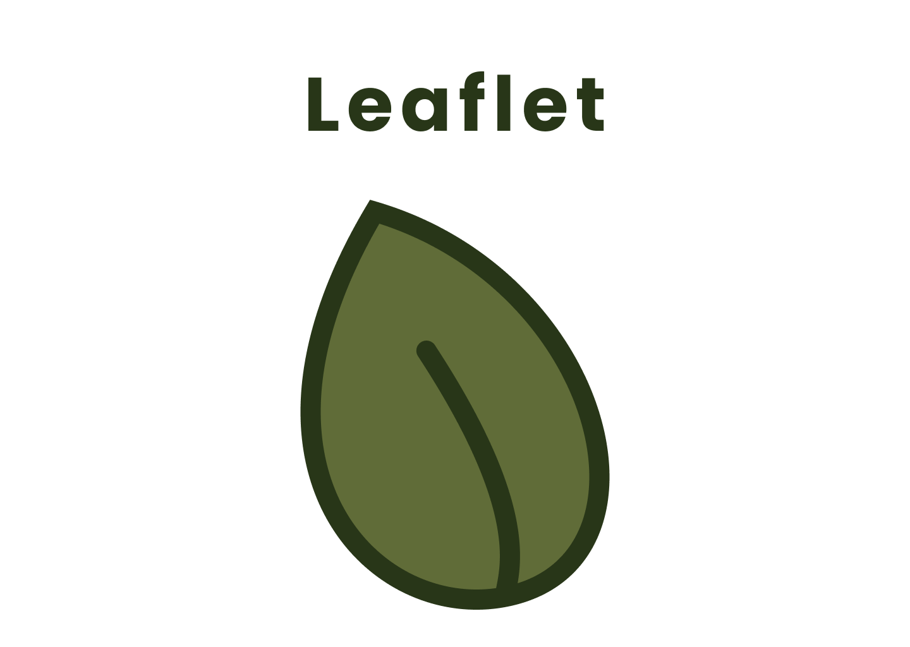

<h1 align="center" id="title">Leaflet</h1>

<p align="center"></p>

<p id="description">A simple flashcards application</p>

<h2>🚀 Demo</h2>

[](https://youtu.be/nrBQJ88_cL4)

<h2>Project Screenshots:</h2>


  
<h2>🧐 Features</h2>

Here're some of the project's best features:

*   Autoplay
*   Shuffle
*   Card Navigation

<h2>🛠️ Installation Steps:</h2>

<p>1. Clone the repo</p>

```
git clone https://github.com/0-BSCode/Leaflet.git
```

<p>2. Install packages</p>

```
npm ci
```

<p>3. Run project (on Android)</p>

```
npm run android
```

  
  
<h2>💻 Built with</h2>

Technologies used in the project:

*   React Native
*   Typescript
*   Expo
*   CSS

<h2>🛡️ License:</h2>

This project is licensed under the GNU General Public License